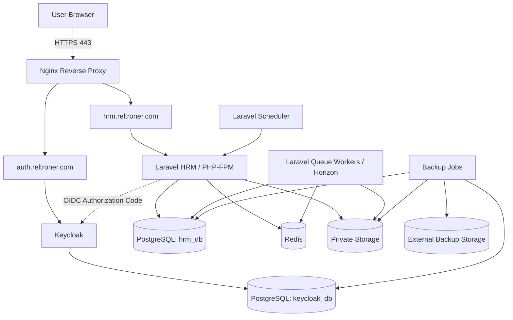
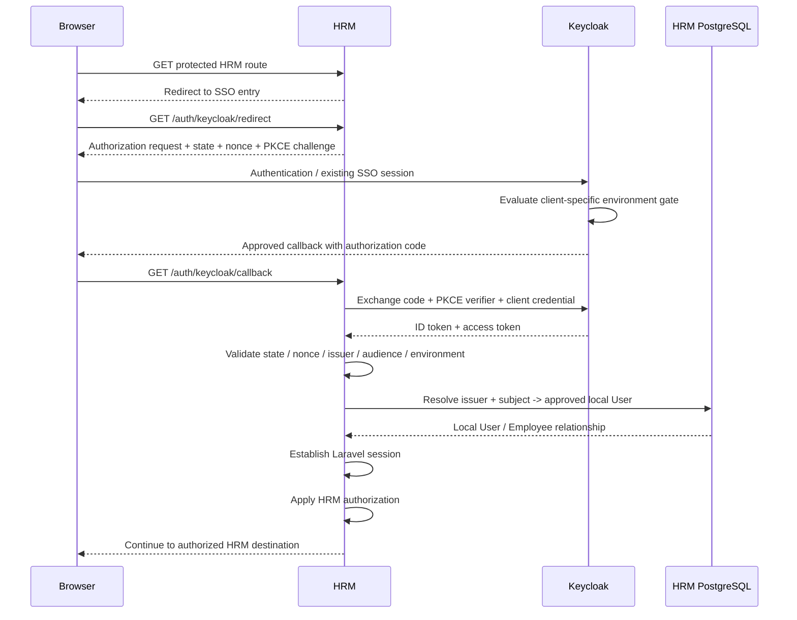
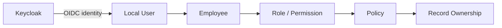
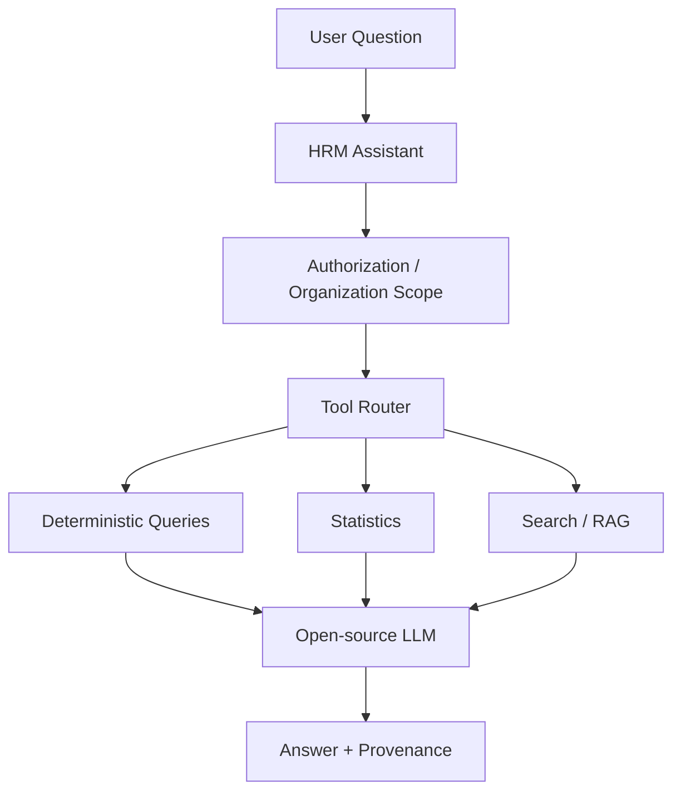

# Reltroner HRM + Auth Platform

## Final Architecture Design & End-to-End Engineering Phases

**Status:** Active Architecture Contract — Implementation Baseline + Production Foundation Refinement

**Primary applications:** `auth.reltroner.com`, `hrm.reltroner.com`

**Architecture style:** Laravel Modular Monolith + Centralized SSO Identity Provider

**Production database:** PostgreSQL 18 only

**Local database:** SQLite or MySQL allowed

**Cache / session / queue:** Redis

**Identity provider:** Keycloak

**Deployment target:** Hostinger VPS

**Open-source policy:** Runtime architecture must use open-source components

**Historical pre-change HRM baseline:** 34 tests, 94 assertions, PASS

**Current verified production-release baseline:** 313 passed, 5 skipped locally, 923 assertions; PostgreSQL 18 CI PASS; Redis integration CI PASS

**Architecture contract revision:** 2026-09-24 Phase 9I freeze. Phase 6 OIDC boundaries remain intact; Phase 9A–9I are now evidence-frozen on active production application release `80a7b6e06277a0520bfa7372b1d489b9521b2182`. This refinement also records release-owned source integrity versus contract-defined shared `storage/`, plus residual non-blocking Phase 9 operational debt. The final end-to-end architecture target and the Production Foundation v1 definition remain unchanged.


---

## Revision Boundary — Sequencing May Evolve, Final Target Does Not

This contract separates two things that must not be conflated:

```text
implementation sequencing / operational safeguards
        may be refined as evidence is discovered

final architecture / security / business capability target
        must not be silently reduced
```

This revision therefore permits changes to:

- engineering order
- release construction rules
- production smoke methodology
- rollback procedures
- evidence requirements
- phase subdivision
- runtime diagnostics
- CI gates

It does **not** remove or weaken the final target for:

- centralized Keycloak identity
- PostgreSQL production persistence
- Redis runtime state
- Laravel modular-monolith trajectory
- local HRM business authorization
- issuer + subject identity linkage
- production/demo identity separation
- auditability
- organization tenancy
- permission-based RBAC
- reporting / analytics
- search
- permission-aware AI
- backup / restore capability
- end-to-end SSO acceptance

Sections 50–54 remain the final acceptance direction. In particular, the **Production Foundation v1 Definition** remains the same target even when intermediate engineering phases are refined.

---

# 1. Purpose

This document defines the final target architecture and the engineering path for evolving the existing `reltroner-hr-app` repository into a production-ready HR platform connected to a centralized Keycloak Single Sign-On service.

The immediate scope is intentionally limited to two public systems:

- `auth.reltroner.com`

- `hrm.reltroner.com`

Other Reltroner applications such as LMS, ERP API, Finance, search, analytics, and AI may later consume the same identity platform, but they are not required to complete the first production milestone.

The purpose is not to rewrite the current HRM application. The strategy is:

\> Discover → preserve baseline → harden → integrate SSO → validate PostgreSQL → productionize → modularize incrementally.

---

# 2. Architecture Principles

## 2.1 HRM remains a modular monolith

The HRM application remains one Laravel application and one deployable business system.

Do not split HR business domains into independent network services such as:

- Employee Service

- Payroll Service

- Attendance Service

- Leave Service

- Role Service

Internal modules are allowed and encouraged, but they live inside the same Laravel repository and process boundary.

## 2.2 Authentication, environment eligibility, and business authorization are separate decisions

The identity boundary has three distinct layers:

| Layer | Question | Authority |
|---|---|---|
| Authentication | Who is this identity? | Keycloak |
| Environment eligibility | May this identity enter production or demo? | Keycloak identity class, re-verified by the consuming Laravel environment |
| Business authorization | What may this user do, in which organization, on which record, and through which transition? | Laravel HRM |

The invariant is:

```text
Keycloak authentication
        !=
environment eligibility
        !=
HRM business authorization
```

Keycloak is responsible for:

- login
- password policy
- account authentication
- MFA
- SSO session
- OIDC identity
- global user identity
- client/environment eligibility classification

HRM remains responsible for:

- Employee relationship
- company / organization membership
- HR role
- domain permissions
- payroll authorization
- leave approval authorization
- attendance rules
- record ownership
- tenant isolation
- business workflow authorization

`production_user` does not mean HRM administrator.

`demo_user` does not mean demo administrator.

A valid Keycloak login must not automatically create an HRM authenticated session or business authority.

The production safety invariant is:

```text
valid OIDC identity
+ correct environment eligibility
+ approved local HRM identity linkage
+ valid HRM authorization
= possible HRM authenticated access
```

If any required layer fails, the request fails closed.

---

## 2.3 PostgreSQL is the production contract

Local development may use:

- SQLite

- MySQL

Production must use:

- PostgreSQL

A release is not considered production-ready merely because SQLite tests pass.

Every production release must pass PostgreSQL migration and application tests.

## 2.4 Infrastructure services are not business microservices

The following are infrastructure dependencies, not business microservices:

- Keycloak

- PostgreSQL

- Redis

- Nginx

- queue workers

- Laravel Horizon

- backup jobs

- monitoring

The business application remains a modular monolith.

## 2.5 Compatibility is removed intentionally, not accidentally

Current HRM behavior includes legacy compatibility around:

- `session('role')`

- `session('employee_id')`

- `users.role`

- `users.employee_id`

- `User -> Employee`

- `Employee -> Role`

- `CheckRole`

These must not disappear as incidental cleanup during SSO integration.

Migration away from them must be explicit, tested, staged, and reversible.

## 2.6 AI is never the source of truth

Future AI capability may explain or retrieve data, but authoritative business values must come from deterministic application logic and database queries.

The LLM must not become the system of record.

---


## 2.7 One browser request must map to one Laravel HTTP lifecycle

For Laravel 13, the public entrypoint must delegate the HTTP lifecycle exactly once.

Canonical production entrypoint:

```php
/** @var Application $app */
$app = require_once __DIR__.'/../bootstrap/app.php';

$app->handleRequest(Request::capture());
```

`Application::handleRequest()` already performs the effective HTTP lifecycle:

```text
resolve HTTP kernel
-> handle request
-> send response
-> terminate kernel
```

The public entrypoint must therefore **not** execute a second legacy lifecycle such as:

```text
$app->make(Kernel::class)
$kernel->handle(...)->send()
$kernel->terminate(...)
```

A duplicate lifecycle can resend content or finalize FastCGI twice, producing symptoms such as `headers already sent`, duplicate side effects, duplicate middleware execution, or misleading framework-level transport errors.

This invariant must remain regression-tested structurally in the repository.

---

# 3. Current HRM Baseline

The current repository is an existing Laravel application with:

- Laravel 13

- Blade-based server rendering

- Laravel session authentication

- custom `CheckRole` middleware

- Eloquent models

- controller-based business orchestration

- Department

- Employee

- Role

- Attendance / Presence

- Leave Request

- Payroll

- Task

- Dashboard

- Profile

- authentication flows

The historical pre-change behavioral checkpoint remains:

```text
Tests:       34 passed
Assertions:  94
Result:      PASS
```

That checkpoint is retained as migration history, not as the current release count.

The current production-release verification checkpoint is:

```text
Laravel:                     13
Local full suite:            313 passed
Local skipped Redis tests:   5
Assertions:                  923
PostgreSQL 18 CI:            PASS
Redis integration CI:        PASS
```

The test count is allowed to increase as architecture coverage increases. A reduction in previously passing behavior must be intentional, reviewed, and explained.

## 3A. Current Implementation State Snapshot — 2026-09-24

This subsection is an implementation snapshot, not a redefinition of the final architecture.

```text
Active production HRM application release:
80a7b6e06277a0520bfa7372b1d489b9521b2182

Retained rollback release:
3723907bc216aece148241bcf749c3edb0658008

Documentation evidence baseline used for Phase 9I closure:
7b6a591ab25af7ccae22ffbf17e0fc02b17f168c
```

At the Phase 9I freeze boundary, the documentation baseline is one docs-only commit ahead of the active application release. No runtime-relevant application source differs between `80a7b6e06277a0520bfa7372b1d489b9521b2182` and that documentation baseline, so redeploying the documentation-only successor is not required to preserve application/runtime identity.

Current production-foundation state:

```text
Phase 9A  Production Deployment Discovery                 PASS / FROZEN
Phase 9B  PHP + Composer Runtime Foundation               PASS / FROZEN
Phase 9C  Immutable Release Staging                       PASS / FROZEN
Phase 9D  Production Environment Foundation               PASS / FROZEN
Phase 9E  Recovery Point + PostgreSQL Migration           PASS / FROZEN
Phase 9F  PHP-FPM + Nginx Activation                      PASS / FROZEN
Phase 9G  HRM TLS + HTTPS Public Cutover                  PASS / FROZEN
Phase 9H  Queue + Scheduler                               PASS / FROZEN
Phase 9I  Production Smoke / Runtime Verification         PASS / FROZEN
```

The Laravel 13 HTTP entrypoint single-dispatch defect discovered during Phase 9I was corrected in repository source, regression-tested, passed the authoritative PostgreSQL/Redis release gates, and was deployed through the immutable release path. The active production release is now `80a7b6e06277a0520bfa7372b1d489b9521b2182`; the prior release remains available as the rollback target.

Phase 9I acceptance evidence proves the active production plane across release/source integrity, production environment, Nginx and systemd configuration, PostgreSQL runtime identity, Redis cache/session/queue behavior, queue depths, failed-job boundary, backup continuity, TLS continuity, Keycloak live/ready/discovery, public HTTP and frontend assets, OIDC initiation, PKCE S256 presence, secure session-cookie attributes, negative callback fail-closed behavior, queue-worker liveness, scheduler real timer execution, bounded application/journal deltas, and database/business-data immutability.

Source-integrity closure uses the deployment boundary defined in Section 38: release-owned tracked source must match the active Git SHA, while persistent shared runtime state is validated by exact shared-path wiring. The ten tracked `storage/**/.gitignore` placeholder files are therefore expected deployment exclusions because active `release/storage` resolves exactly to `/opt/reltroner/apps/hrm/shared/storage`. Of 6,521 Git-archive regular files inspected, 10 were those expected placeholders and the remaining 6,511 release-owned files had zero hash/type/read mismatches.

No production identity linking was performed during Phase 9I. Positive browser authorization-code completion into an approved local HRM User, cross-environment browser acceptance, and logout end-to-end acceptance remain controlled-linking/Phase 10 work. Phase 8 therefore remains operationally open even though Phase 9 is frozen.

---

# 4. Final Production Topology



---

# 5. Public and Private Network Boundaries

## 5.1 Public

Only services required by users should be publicly exposed.

```text

80/tcp   -> redirect to HTTPS

443/tcp  -> Nginx only

22/tcp   -> SSH, restricted

```

Public hostnames:

```text

auth.reltroner.com

hrm.reltroner.com

```

## 5.2 Private

The following services must not be directly exposed to the internet:

```text

PostgreSQL

Redis

Keycloak internal HTTP port

PHP-FPM

Horizon dashboard unless protected

internal metrics endpoints

backup volumes

```

Example internal topology:

```text

127.0.0.1:8080   Keycloak

127.0.0.1:5432   PostgreSQL

127.0.0.1:6379   Redis

unix socket       PHP-FPM

```

If Docker networking is used, equivalent private container networking should be used instead of binding infrastructure ports publicly.

---

# 6. DNS and TLS

Required DNS:

```text

auth.reltroner.com  -> VPS public IP

hrm.reltroner.com   -> VPS public IP

```

Nginx terminates TLS.

Certificates should use an open-source ACME client and Let's Encrypt.

Required behavior:

```text

http://auth.reltroner.com

        ↓

https://auth.reltroner.com

http://hrm.reltroner.com

        ↓

https://hrm.reltroner.com

```

TLS termination belongs at Nginx.

The demo hostname is a Phase 6 identity-contract endpoint and is deployed only when the demo application plane is required:

```text
hrm-demo.reltroner.com
```

Its absence before demo deployment does not invalidate a Keycloak-side authorization contract, but full demo browser/application acceptance remains deferred until the approved endpoint exists.

Backend services may communicate over the private host/container network.

---

# 7. Production Data Plane

One PostgreSQL server may serve both Keycloak and HRM to conserve VPS resources.

Isolation must occur using separate databases and separate database users.

```text

PostgreSQL Instance

│

├── keycloak_db

│     owner: keycloak_app

│

└── hrm_db

      owner: hrm_app

```

Do not:

- share one application DB user

- allow HRM to query Keycloak tables

- allow Keycloak to query HRM tables

- use PostgreSQL superuser credentials in application `.env`

- expose PostgreSQL publicly

If a demo application plane is deployed, it must use a physically distinct application database and credential:

```text
hrm_demo_app
  -> hrm_demo_db only
```

Production and demo application credentials must not have cross-database access.

Demo should use deterministic synthetic data rather than a production copy with scattered demo row flags.

Suggested permissions:

```text

keycloak_app

  -> keycloak_db only

hrm_app

  -> hrm_db only

backup_operator

  -> backup permissions only

```

---

# 8. Environment Database Matrix

| Environment | Allowed Database | Purpose |

|---|---|---|

| Local development | SQLite | Fast local development |

| Local development | MySQL | Optional compatibility |

| Local integration | PostgreSQL | Production compatibility |

| CI | PostgreSQL | Mandatory release gate |

| Staging | PostgreSQL | Production rehearsal |

| Production | PostgreSQL | Mandatory |

| Demo (when deployed) | PostgreSQL | Isolated synthetic-data environment |

SQLite must never be treated as proof of PostgreSQL compatibility.

---

# 9. PostgreSQL Compatibility Rules

The application must avoid database-specific SQL unless the query is explicitly isolated behind a database-aware implementation.

Known migration concern:

The current dashboard aggregation uses the MySQL-style function:

```sql

MONTH(date)

```

Production PostgreSQL requires compatible behavior such as:

```sql

EXTRACT(MONTH FROM date)

```

Prefer a portable query abstraction when feasible.

Release validation must detect:

- MySQL-only functions

- SQLite-only assumptions

- case-sensitivity differences

- boolean differences

- date/time behavior differences

- index differences

- `GROUP BY` behavior differences

- migration rollback ordering

- foreign-key dependency ordering

---

# 10. Redis Architecture

Redis becomes the production runtime state infrastructure.

Primary responsibilities:

```text

Laravel sessions

cache

queue

rate limiting

distributed locks

temporary application state

Horizon queue backend

```

Target production settings conceptually:

```env

SESSION_DRIVER=redis

CACHE_STORE=redis

QUEUE_CONNECTION=redis

```

Redis is not the system of record.

If Redis is lost, authoritative HR business data must remain in PostgreSQL.

---

# 11. Queue Architecture

Initial queue topology:

```text

critical

default

notifications

imports

reports

maintenance

```

Future optional:

```text

search-indexing

ai-indexing

analytics

```

Resource-conscious VPS startup:

```text

1 supervisor

1-2 total workers initially

```

Scale only from observed queue latency and CPU/RAM metrics.

---

# 12. Keycloak Identity Architecture

Keycloak is the centralized identity provider for Reltroner applications.

Application realm:

```text
reltroner
```

Phase 6 defines two HRM web clients inside the same realm:

```text
hrm-web       -> production HRM environment
hrm-demo-web  -> demo HRM environment
```

Both are server-side confidential OpenID Connect clients.

The realm also defines environment identity classes:

```text
production_user
demo_user
service_account
```

These are identity-plane classifications only. They are not HRM business roles.

Human identity classification follows this administrative invariant:

```text
human identity:
EXACTLY ONE OF
production_user
demo_user
```

A human identity with both classifications is invalid unless a later architecture decision explicitly defines and audits a dual-environment exception.

Service identity classification follows:

```text
service identity:
service_account
```

Interactive service identities must not be treated as HRM human users.

The Keycloak platform administrator remains separated from application identities and is managed through the administrative realm rather than by granting HRM environment roles.

The design intentionally keeps one realm because production and demo currently share one identity lifecycle, password/MFA policy, and administrative plane. A separate demo realm should be introduced only if a real requirement demands independently isolated identity lifecycle or simultaneously independent SSO sessions.

Future clients may include:

```text
lms-web
erp-api
finance-web
reltroner-studio
automation
```

Do not create separate realms per application without a real security or organizational boundary.

---

# 13. HRM OIDC Dual-Client Contract

The HRM identity plane uses two confidential server-side web clients.

| Setting | `hrm-web` | `hrm-demo-web` |
|---|---|---|
| Protocol | OpenID Connect | OpenID Connect |
| Environment | Production | Demo |
| Client authentication | ON | ON |
| Standard Flow / Authorization Code | ON | ON |
| PKCE | Required, S256 | Required, S256 |
| Implicit Flow | OFF | OFF |
| Direct Access Grants | OFF | OFF |
| Service Account Roles | OFF | OFF |
| Authorization Services | OFF | OFF |
| Standard Token Exchange | OFF | OFF |
| JWT Authorization Grant | OFF | OFF |
| Device Authorization Grant | OFF | OFF |
| CIBA | OFF | OFF |
| Full Scope Allowed | OFF | OFF |
| Client secret | Unique | Unique |

Client secrets must never be reused:

```text
hrm-web secret
!=
hrm-demo-web secret
```

The demo runtime must never receive the production client secret.

### Production URI contract

```text
Root URL:
https://hrm.reltroner.com

Home URL:
https://hrm.reltroner.com

Redirect URI:
https://hrm.reltroner.com/auth/keycloak/callback

Post-logout redirect:
https://hrm.reltroner.com/
```

### Demo URI contract

```text
Root URL:
https://hrm-demo.reltroner.com

Home URL:
https://hrm-demo.reltroner.com

Redirect URI:
https://hrm-demo.reltroner.com/auth/keycloak/callback

Post-logout redirect:
https://hrm-demo.reltroner.com/
```

Redirects must remain exact.

The following are forbidden:

```text
*
https://*.reltroner.com/*
shared production/demo callback
localhost callback on production clients
```

`Web Origins` should remain empty when the server-rendered Laravel application does not make browser-side CORS calls directly to Keycloak. If a browser-side Keycloak API requirement appears later, allow only the exact required origin.

### Minimal scopes and token boundary

Requested baseline scopes:

```text
openid
profile
email
```

Environment identity claims must be intentionally scoped rather than exposing every realm role.

Dedicated client scopes are:

```text
hrm-production-identity
hrm-demo-identity
```

The production identity scope is linked only to `hrm-web` and exposes only the production identity classification required by the application contract.

The demo identity scope is linked only to `hrm-demo-web` and exposes only the demo identity classification required by the application contract.

The canonical environment evidence may be represented by the scoped identity claim:

```text
reltroner_identity_class
```

with the expected environment-specific value.

This claim is an environment boundary signal only. It is never a source of HRM business permission.

Do not include unrelated realm roles, groups, address, phone, or `offline_access` unless a later concrete requirement proves they are necessary.

Before any production cutover, use client-scope evaluation and representative tokens to verify that claims remain minimal and no cross-environment identity classification leaks into the wrong client.

---

# 14. Browser Authentication and Environment-Gate Flow

The browser authentication path has two independent enforcement layers.

## Gate A — Keycloak client/environment gate

Client-specific browser flow bindings:

```text
hrm-web
  -> browser-hrm-production-v2

hrm-demo-web
  -> browser-hrm-demo-v2
```

The flow performs normal browser authentication and then evaluates the environment identity class.

Conceptually:

```text
hrm-web
  -> authenticated identity
  -> production_user present?
       YES -> authorization may continue
       NO  -> DENY

hrm-demo-web
  -> authenticated identity
  -> demo_user present?
       YES -> authorization may continue
       NO  -> DENY
```

The environment gate must be evaluated for both:

```text
fresh authentication
existing Keycloak SSO cookie
```

An already-authenticated SSO cookie must never bypass the client-specific environment check.

## Gate B — Laravel callback gate

Keycloak-side denial is not sufficient as the only production control.

After authorization-code exchange, Laravel must independently validate:

```text
authorization response state
PKCE verifier
ID-token signature
issuer
audience / authorized client
expiry / temporal claims
nonce
expected environment identity claim
local HRM identity linkage
business authorization
```

The callback state machine is:

```text
GET /login or SSO entry
  -> generate state
  -> generate nonce
  -> generate PKCE verifier
  -> derive S256 challenge
  -> store transient values in server-side session
  -> redirect to Keycloak

GET /auth/keycloak/callback?code=...&state=...
  -> state matches?
       NO -> reject
  -> exchange code with verifier + confidential client credential
  -> validate ID token
  -> nonce matches?
       NO -> reject
  -> issuer/client/environment valid?
       NO -> reject
  -> resolve identity by issuer + subject
  -> approved local HRM linkage exists?
       NO -> 403 / no HRM session
  -> establish local session
  -> HRM business authorization remains authoritative
```

The overall path is:



Keycloak authentication success is necessary but not sufficient for HRM access.

---

# 15. Identity Mapping

The permanent external identity key is:

```text
issuer + subject
```

Do not use email, username, or `preferred_username` as the primary trust anchor.

Email may change.

The OIDC `sub` value is stable only within its issuer namespace, therefore both values are retained.

Preferred final model:

```text
users
│
└── external_identities
      ├── id
      ├── user_id
      ├── provider
      ├── issuer
      ├── subject
      ├── email_at_link
      ├── linked_at
      ├── last_login_at
      └── timestamps
```

Required identity uniqueness:

```text
UNIQUE(issuer, subject)
```

`provider` may remain useful as application metadata, but it must not replace the issuer namespace in the trust key.

For the current Keycloak realm, the canonical issuer is:

```text
https://auth.reltroner.com/realms/reltroner
```

This keeps local HRM identity independent from mutable profile fields and prevents email changes from creating a new authority relationship.

---

# 16. First Login / Account Linking Policy

The system must define deterministic first-login behavior.

Production authentication must never convert identity proof directly into business authority.

Forbidden pattern:

```text
valid Keycloak login
  -> firstOrCreate user by email
  -> immediately authenticate
```

Preferred production behavior:

1. Validate the OIDC callback completely.
2. Resolve identity by `(issuer, subject)`.
3. If an approved identity link exists, resolve its local User.
4. If no approved identity link exists, deny HRM access unless an explicitly controlled migration/provisioning workflow authorizes linking.
5. Never auto-link an unverified email.
6. Never create Employee, Membership, HR role, or business permissions merely because OIDC authentication succeeded.
7. Record identity-link creation and removal in audit logs.

Production invariant:

```text
valid OIDC identity
+ production_user
+ approved local HRM linkage
= possible HRM session

valid OIDC identity
+ production_user
+ no approved HRM linkage
= 403 / no HRM authenticated session
```

A controlled migration stage may use verified email as a matching hint for a pre-provisioned account, but email is not the permanent identity key and the callback must not silently create production authority.

A future demo environment may use a more permissive synthetic-data provisioning policy, but that is a demo-specific policy and must not be inherited by production.

---

# 17. Local User Remains Required

Keycloak does not replace the HRM `users` table.

Local User remains necessary for:

- Employee relationship

- application authorization

- organization membership

- audit ownership

- record ownership

- domain references

- local preferences

- application-specific state

The identity chain becomes:

```text

Keycloak User

     │

     │ sub

     ▼

ExternalIdentity

     │

     ▼

Local User

     │

     ▼

Employee

     │

     ▼

Role / Permissions / Organization

```

---

# 18. Authentication vs Authorization Boundary



Keycloak does not decide whether a user may:

- approve a specific leave request

- read another employee's payroll

- edit another employee's attendance

- delete an HR record

- modify protected roles

Those remain HRM business authorization decisions.

---

# 19. Legacy RBAC Compatibility

The current application uses a compatibility role chain.

Existing role resolution must be preserved during initial SSO integration.

Conceptually:

```text

session('role')

      ↓

employee->role->title

      ↓

users.role

```

Current `CheckRole` may also write:

```text

session('role')

session('employee_id')

```

During SSO migration:

```text

Keycloak Authentication

        ↓

Local User

        ↓

Existing User/Employee relationship

        ↓

Existing CheckRole compatibility

```

Do not combine SSO migration with a simultaneous RBAC rewrite.

---

# 20. Long-Term Authorization Target

After SSO is stable, move gradually toward:

```text

User

  ↓

Membership

  ↓

Organization

  ↓

Role

  ↓

Permission

  ↓

Policy

  ↓

Record Ownership

```

Example permissions:

```text

employee.view

employee.create

employee.update

attendance.self.checkin

attendance.view.self

attendance.manage

leave.request

leave.view.self

leave.approve

payroll.view.self

payroll.view.all

payroll.process

task.view.self

task.manage

report.view

audit.view

```

This is a later phase.

It must not block SSO deployment.

---

# 21. Logout Architecture

Logout has two layers:

```text
Laravel local session
Keycloak SSO session
```

Production target:

```text
hrm-web
  -> invalidate local production HRM session
  -> regenerate CSRF token
  -> optional/required RP-initiated Keycloak logout according to policy
  -> exact production post_logout_redirect_uri
```

Demo target:

```text
hrm-demo-web
  -> invalidate local demo HRM session
  -> regenerate CSRF token
  -> Keycloak logout according to demo policy
  -> exact demo post_logout_redirect_uri
```

Because production and demo use one Keycloak realm, a global Keycloak logout may affect another client session in the same realm. That is acceptable while human production/demo classifications remain mutually exclusive.

If future requirements demand simultaneously independent production and demo SSO sessions for the same person, evaluate a stronger identity-plane separation such as a dedicated demo realm. Do not introduce that complexity without a concrete requirement.

The Laravel session plane must also remain environment-specific.

Do not share a broad parent-domain session cookie such as:

```text
SESSION_DOMAIN=.reltroner.com
```

between production and demo.

Target session separation:

```text
production:
  host-only cookie
  production-specific cookie name
  production APP_KEY
  production Redis session namespace

demo:
  host-only cookie
  different cookie name
  different APP_KEY
  different Redis session namespace
```

The current application contains both GET and POST logout routes.

Do not remove legacy GET logout until:

- all callers are identified
- templates are migrated
- SSO logout works
- tests cover the new behavior

---

# 22. SSO Failure Behavior

If Keycloak is unavailable:

```text

new authentication fails

existing valid Laravel sessions may continue until expiry

```

Production readiness therefore requires:

- Keycloak restart policy

- Keycloak health checks

- PostgreSQL persistence

- service monitoring

- resource limits

- backup

- recovery documentation

One VPS deployment is production-capable but not highly available.

---

# 23. HRM Modular Monolith Target

```text

app/

├── Modules/

│   ├── Identity/

│   │   ├── Http/

│   │   ├── Oidc/

│   │   ├── Actions/

│   │   └── Models/

│   │

│   ├── Organization/

│   │   ├── Organizations/

│   │   ├── Memberships/

│   │   └── Permissions/

│   │

│   ├── People/

│   │   ├── Employees/

│   │   ├── Departments/

│   │   └── Roles/

│   │

│   ├── Attendance/

│   ├── Leave/

│   ├── Payroll/

│   ├── Work/

│   ├── Documents/

│   ├── Reporting/

│   ├── Analytics/

│   ├── Search/

│   ├── Assistant/

│   ├── Audit/

│   ├── Notifications/

│   └── Integrations/

│

├── Shared/

│   ├── Auth/

│   ├── Contracts/

│   ├── Support/

│   └── ValueObjects/

│

└── Providers/

```

Do not move the whole codebase in one refactor.

Modules must be extracted incrementally.

---

# 24. Internal Module Rule

A module may contain:

```text

Http/Controllers

Http/Requests

Models

Policies

Actions

Queries

Services

Events

Listeners

Jobs

DTOs

```

but only when needed.

Simple CRUD does not require every layer.

Preferred rule:

```text

Controller

    ↓

Request validation

    ↓

Action / Service only for meaningful business orchestration

    ↓

Model / Query

    ↓

Database

```

Avoid architecture for architecture's sake.

---

# 25. Domain Boundaries

## Identity

Owns:

- OIDC redirect

- callback

- external identity mapping

- local session establishment

- SSO logout

- identity synchronization

Does not own:

- payroll permission

- leave approval rules

- HR record ownership

## Organization

Future owner of:

- organizations

- membership

- organization context

- tenant isolation

## People

Owns:

- employees

- departments

- roles during compatibility phase

## Attendance

Owns:

- presence

- check-in

- check-out

- attendance validation

## Leave

Owns:

- leave requests

- approval workflow

## Payroll

Owns:

- salary calculation

- payroll records

- payroll workflow

## Work

Owns:

- tasks

- task state transitions

## Audit

Owns:

- sensitive activity logging

- authorization-relevant change history

---

# 26. Record-Level Authorization

Route role authorization is not sufficient.

The following questions must be answered independently:

```text

May this role access this feature?

May this user access this particular record?

May this user perform this particular state transition?

```

Final authorization should move toward Policies.

Examples:

```text

PayrollPolicy

LeaveRequestPolicy

PresencePolicy

TaskPolicy

EmployeePolicy

RolePolicy

```

Index query filtering and record-level policy checks must agree.

---

# 27. Current Security Risks to Resolve

Known risk candidates include:

- unauthenticated dashboard presence endpoint

- public employee endpoint exposing employee data

- state-changing GET routes

- GET logout

- incomplete record ownership checks

- legacy session role priority

- weak `users.employee_id` schema relationship

- protected role update inconsistency

- application-only payroll duplicate protection

- sensitive payroll data in error logs

- MySQL-specific dashboard date aggregation

- attendance date/datetime inconsistency

- stale/unwired route source

- legacy RBAC tests that disable middleware

Each should receive:

```text

reproduction

risk classification

targeted test

minimal fix

regression test

```

---

# 28. Production Data Integrity

Important constraints should exist at the database level whenever practical.

Examples:

```text

employees.email UNIQUE

presences UNIQUE(employee_id, date)

external_identities UNIQUE(provider, subject)

```

Future candidates:

```text

payrolls UNIQUE(employee_id, payment_date)

roles scoped uniqueness

organization-scoped uniqueness

```

Do not add constraints before checking existing production data for violations.

---

# 29. Audit Architecture

Sensitive changes must generate audit records.

Minimum events:

```text

SSO identity linked

SSO identity unlinked

employee created

employee updated

employee deleted

role changed

permission changed

leave approved

leave rejected

attendance manually edited

payroll created

payroll updated

payroll deleted/reversed

```

Audit records should include:

```text

actor

action

subject type

subject id

before

after

timestamp

request correlation id

IP where appropriate

reason when required

```

Passwords and tokens must never be logged.

---

# 30. Application Secrets

Secrets belong outside the repository.

Examples:

```text

APP_KEY

database password

Redis credentials

OIDC client secret

Keycloak bootstrap credentials

SMTP credentials

backup credentials

```

Do not commit `.env.production`.

---

# 31. Token and Session Handling

Preferred design:

```text
Browser
  ↓
Laravel server
  ↓
Keycloak Authorization Code + PKCE exchange
  ↓
server-side token validation
  ↓
issuer + subject identity resolution
  ↓
environment eligibility verification
  ↓
Laravel session cookie
```

The browser should primarily use Laravel's secure session cookie for HRM.

Session cookie requirements:

```text
Secure
HttpOnly
SameSite appropriate to flow
HTTPS only
session rotation after authentication
host-only where practical
environment-specific cookie name
```

Do not store access tokens in browser localStorage for the server-rendered HRM.

Production and demo must not share a Laravel session plane.

If both environments use the same Redis server, use distinct logical namespace/prefixing and credentials/permissions where practical so that:

```text
production Laravel session
!=
demo Laravel session
```

Environment identity claims are validated as admission signals only. They do not replace local HRM roles, permissions, organization membership, policy evaluation, or record ownership.

---

# 32. CSRF and HTTP Semantics

State mutation should ultimately use:

```text

POST

PUT

PATCH

DELETE

```

not GET.

Target examples:

```text

POST /leave_requests/{id}/approve

POST /leave_requests/{id}/reject

PATCH /tasks/{task}/status

POST /logout

```

Migration must inspect all current callers before changing route contracts.

---

# 33. Rate Limiting

Apply rate limiting to:

- authentication entrypoints where appropriate

- callback misuse

- public API endpoints

- high-cost exports

- search

- future AI endpoints

Rate limit counters may use Redis.

---

# 34. Health Architecture

Health checks should separate:

```text

liveness

readiness

dependencies

```

Examples:

### Liveness

```text

Laravel process responds

Keycloak process responds

```

### Readiness

```text

PostgreSQL reachable

Redis reachable

required migrations applied

application configuration valid

```

Avoid exposing sensitive dependency details publicly.

For production acceptance, health is evaluated at multiple boundaries:

```text
process liveness
-> dependency readiness
-> application route health
-> external HTTPS reachability
-> post-release runtime stability
```

Minimum HRM production probes should include:

```text
GET /up                         -> 200
GET /login                      -> 200
GET /                           -> expected redirect contract
anonymous protected route       -> authentication gate
frontend build assets            -> 200
```

Internal readiness checks may additionally prove PostgreSQL, Redis, migration state, queue worker state, scheduler state, and cached configuration. Public health responses must not expose secret material or detailed internal dependency topology.

---

# 35. Observability

Minimum production observability:

```text
structured application logs
Nginx access/error logs
Laravel exception logs
Keycloak logs
PostgreSQL logs
queue failure visibility
request correlation ID
disk usage monitoring
memory monitoring
CPU monitoring
backup status
```

Start lightweight, but acceptance must be evidence-driven.

## 35.1 Acceptance-window log delta

Production smoke tests must distinguish:

```text
historical log entries
expected negative-test events
unexpected new severe events
```

Do not treat either of these shortcuts as sufficient:

```text
"there are ERROR lines"        -> therefore production is broken
"the endpoint returned 200"    -> therefore runtime is clean
```

Instead:

1. establish a log/time/size baseline immediately before the smoke window;
2. run a bounded test action;
3. inspect only the new delta;
4. classify known expected negative-test events narrowly;
5. fail on unclassified severe events;
6. confirm Nginx/PHP-FPM/systemd continuity and application health separately.

Expected negative tests may intentionally generate application error-level audit or rejection events. Such events may be accepted only when they are deterministic, bounded to the exact test action, and do not mask an unrelated failure.

Framework transport errors such as `headers already sent`, duplicate response output, repeated FastCGI finalization, or unexpected response-send exceptions are **not** benign by default. They remain real defects until a source-level invariant proves otherwise.

## 35.2 Secret-safe diagnostics

Diagnostic output must not print:

```text
.env contents
runtime secrets
OIDC state
OIDC nonce
PKCE verifier
client secret
session cookie value
access token
ID token
TLS private key
raw authorization code
raw sensitive application log context
```

Where diagnostics need classification, prefer safe fingerprints, exception classes, relative source paths, status codes, counts, and explicitly redacted metadata.

---

# 36. Backup Architecture

Backup scope:

```text

PostgreSQL keycloak_db

PostgreSQL hrm_db

uploaded HRM files

Keycloak realm configuration where useful

Nginx configuration

deployment configuration

environment-secret recovery procedure

```

Backups must be copied off-VPS.

A backup that exists only on the same VPS is not sufficient disaster recovery.

---

# 37. Restore Testing

Required periodic procedure:

1. provision temporary recovery environment

2. restore PostgreSQL

3. restore uploaded files

4. start Keycloak

5. start HRM

6. test login

7. test representative HR flows

8. record restore duration and issues

---

# 38. Deployment Filesystem

Canonical HRM layout:

```text
/opt/reltroner/apps/hrm/
├── current -> releases/<active-git-sha>
├── releases/
│   ├── <previous-git-sha>/
│   └── <candidate-git-sha>/
└── shared/
    ├── .env
    └── storage/
```

Broader VPS layout may remain:

```text
/opt/reltroner/
├── infra/
├── apps/
├── backups/
├── logs/
└── scripts/
```

Required invariants:

- `current` is an atomic symlink pointer, not a mutable application directory;
- each release directory is identified by a known Git SHA;
- shared environment and persistent storage are outside the release directory;
- source-integrity checks compare release-owned Git source to the active release while contract-defined shared runtime state is verified through exact shared-path wiring rather than requiring placeholder files to remain physically inside the release;
- the previously active release is retained as a rollback point;
- an active or sealed release is never patched manually in place;
- rollback is performed by switching `current` to a known prior release and restarting affected long-lived runtimes.

## 38.1 Candidate, sealed, active, retained lifecycle

A release has explicit states:

```text
candidate
  -> final SHA path exists but is not active

sealed
  -> dependencies, shared wiring, generated caches, metadata,
     migrations/pre-switch checks, and path-integrity checks PASS

active
  -> current points to the sealed release

retained
  -> previous release remains available for rollback
```

A candidate may be constructed inside its **final SHA path** before activation. Immutability begins when the candidate is sealed for cutover; it does not require building in a temporary pathname that is later renamed.

## 38.2 Relocation-sensitive generated artifacts

Laravel caches and dependency metadata may contain absolute or base-path-derived values. Therefore:

```text
DO NOT
build relocation-sensitive artifacts under:
releases/.staging-*
then rename the directory
and assume every generated artifact is relocation-safe
```

Preferred rule:

```text
extract source
-> place candidate at final releases/<git-sha> path
-> wire shared .env/storage
-> install/optimize dependencies in final path
-> build config/route/view caches in final path
-> verify no stale staging-path references
-> seal candidate
-> atomic current switch
```

If a temporary staging path is used for transport or extraction, any path-sensitive generated artifact created there must be regenerated after the final-path move and before activation.

Recommended pre-switch checks include safe scans for stale `releases/.staging-` references inside generated artifacts such as `bootstrap/cache` and `vendor/composer` where applicable.

## 38.3 Release-owned source integrity vs shared runtime state

Production source-integrity verification must respect the deployment ownership boundary.

The canonical production wiring intentionally replaces the release-local `storage/` path with shared persistent state:

```text
releases/<active-git-sha>/storage
        -> /opt/reltroner/apps/hrm/shared/storage
```

Therefore the integrity invariant is:

```text
release-owned Git source
        must match the active Git SHA

contract-defined shared runtime state
        must match the approved shared-path wiring
```

It is **not** required that every tracked repository path remain physically present inside the active release when that path is intentionally superseded by the deployment contract.

For the Phase 9I freeze of `80a7b6e06277a0520bfa7372b1d489b9521b2182`, the Git archive contained 6,521 regular files. The only ten tracked paths absent from the active release were these placeholder files:

```text
storage/app/.gitignore
storage/app/private/.gitignore
storage/app/public/.gitignore
storage/framework/.gitignore
storage/framework/cache/.gitignore
storage/framework/cache/data/.gitignore
storage/framework/sessions/.gitignore
storage/framework/testing/.gitignore
storage/framework/views/.gitignore
storage/logs/.gitignore
```

These are classified as **expected deployment exclusions**, not source drift, only because all of the following were proven together:

```text
tracked storage paths are placeholder-only
release/storage is a symlink
release/storage resolves exactly to shared/storage
active release SHA remains unchanged before/after the check
remaining 6,511 release-owned files have zero hash mismatch
remaining 6,511 release-owned files have zero type mismatch
remaining 6,511 release-owned files have zero read error
```

Any missing non-placeholder release-owned file, unexpected tracked file under the shared boundary, wrong shared-storage target, hash/type/read mismatch, or active-SHA change fails the integrity gate closed.

---

# 39. Container Strategy

The architecture is compatible with Docker Compose.

A reasonable production stack may contain:

```text

nginx

keycloak

postgres

redis

hrm-php

hrm-worker

hrm-scheduler

```

Containerization is an operational choice, not an architectural goal.

Do not add Kubernetes.

---

# 40. CI Pipeline

A production candidate pipeline should perform:

```text
composer validation
composer install
frontend dependency/build validation where required
lint / static analysis where configured
unit tests
feature tests
PostgreSQL migration compatibility
PostgreSQL full application suite
Redis integration suite for Redis-dependent runtime behavior
security/dependency scan where configured
artifact / release metadata preparation
```

Minimum production release gate:

```text
exact Git SHA known
working tree clean
PostgreSQL 18 workflow PASS
full application suite PASS
required Redis integration workflow PASS
no unexpected source diff
release rollback target known
```

SQLite-only success is not enough.

A local test run is useful development evidence, but GitHub CI remains the release gate when the workflow defines the authoritative PostgreSQL or Redis environment.

---

# 41. PostgreSQL CI Workflow

The production-compatibility workflow must use PostgreSQL 18 and prove both forward and rollback behavior.

Canonical sequence:

```text
CI runner
   |
   +-- start PostgreSQL 18
   +-- create clean test database
   +-- verify PostgreSQL connection/version
   +-- migrate:fresh
   +-- run known portability regression tests
   +-- run full application test suite
   +-- migrate:rollback / rollback acceptance
   +-- migrate:fresh again
   +-- confirm rebuild succeeds
   +-- destroy CI database
```

The release gate is not satisfied merely because migrations run once. Rollback/rebuild acceptance protects the repository from migration ordering, foreign-key dependency, and historical compatibility regressions.

CI must never reuse production credentials.

## 41A. Redis Integration CI Workflow

Redis-dependent production behavior must be tested against an authenticated Redis service rather than inferred from mocked or skipped tests.

The integration workflow should verify:

```text
Redis authentication required
named Laravel Redis connections resolve
logical DB separation preserved
cache operations work
session persistence works
queue dispatch works
worker processing works
failed job persistence works
safe structured queue failure logging works
full suite remains compatible with Redis integration enabled
```

The production logical database contract remains:

```text
default   -> DB 0
cache     -> DB 1
queue     -> DB 2
session   -> DB 3
```

Redis integration tests may be skipped in an ordinary local test run when the explicit integration flag is absent, but the release gate must still have authoritative Redis integration evidence before Production Foundation v1 is frozen.

---

# 42. Release Artifact

Production deployment is always tied to a known Git commit.

A release should record at least:

```text
Git SHA
parent / prior production SHA
release reason
release timestamp
migration state
PostgreSQL CI result
Redis integration CI result when required
dependency lock hashes
frontend build / asset result
final release path
activation result
rollback target
deployment operator / automation identity
```

A production release is not a mutable checkout.

Forbidden:

```text
editing PHP source directly inside active release
editing vendor files to fix an application bug
copying one changed file into current without a new Git SHA
silently rebuilding only part of active release
```

Source correction must follow:

```text
repository change
-> regression test
-> commit
-> CI
-> new immutable candidate SHA
-> cutover
-> production smoke
```

---

# 43. Low-Risk Deployment Sequence

Canonical deployment sequence:

```text
1.  verify exact source SHA / CI release gates
2.  backup / verify recovery point
3.  create candidate in final releases/<git-sha> path
4.  extract exact source artifact
5.  wire shared .env and storage
6.  install production dependencies in final path
7.  verify/build frontend assets in final path or verify approved prebuilt assets
8.  build config/routes/views caches in final path
9.  verify permissions and no stale staging-path references
10. run internal Laravel/runtime contract checks
11. run safe PostgreSQL migrations / prove migration no-op when expected
12. seal candidate metadata and integrity
13. atomically switch current -> new release
14. restart PHP-FPM and long-lived queue workers
15. verify scheduler timer continuity
16. run public HTTPS health/login/assets/OIDC-initiation smoke
17. verify database / queue / failed-job invariants
18. inspect bounded observability delta
19. if any mandatory gate fails, atomically restore previous current target and restart affected runtimes
20. if all gates pass, retain prior release as rollback point and freeze the deployment subphase
```

Important path rule:

> A directory rename after Composer optimization or Laravel cache generation is not assumed to be safe. Build relocation-sensitive generated artifacts only after the release has reached its final SHA path, or rebuild them after relocation before activation.

Queue workers are long-lived and may continue executing code loaded from the prior release until restarted. Therefore every release switch that changes application code must restart or gracefully reload the production worker.

The scheduler timer itself may remain enabled across release switches because each oneshot execution resolves `current`, but timer state and the next execution must be re-verified.

Rollback must be planned before migration and proven possible before a cutover is declared complete.

---

# 44. Database Migration Discipline

Production migrations must be:

- additive where possible

- backward compatible across release transition

- tested on PostgreSQL

- safe for existing rows

- aware of lock duration

- reversible where realistically possible

Do not rewrite old migrations merely to make history look cleaner.

Use new corrective migrations for already-deployed systems.

---

# 45. Zero / Low Downtime Principles

Target:

```text

low downtime

predictable rollback

data safety

```

Use expand-and-contract migration when needed:

```text

add new column/table

deploy compatible application

backfill

switch reads/writes

validate

remove old structure in later release

```

---

# 46. End-to-End Engineering Phases

## Phase 0 — Freeze the Known-Good Baseline

### Goal

Ensure existing HRM behavior is reproducible before architecture changes.

### Tasks

- preserve `.discovery/ARCHITECTURE-CONTRACT.md`

- preserve `.discovery/AGENT-READ-FIRST.md`

- record current Git SHA

- preserve test baseline

- verify clean tracked working tree

- capture current route map

- capture current migration map

- capture current environment contract

### Exit Criteria

```text

34 tests

94 assertions

PASS

```

No unexplained tracked source modifications.

---

## Phase 1 — PostgreSQL Compatibility Gate

### Goal

Make PostgreSQL a proven application target before deployment.

### Tasks

- provision local/CI PostgreSQL

- create disposable HRM test DB

- run `migrate:fresh`

- run complete test suite

- identify SQL portability problems

- replace MySQL-specific dashboard month aggregation

- verify date/time behavior

- verify unique constraints

- verify migration ordering

- run targeted database integration tests

### Explicitly Inspect

```text

DashboardController

Presence migrations

HR migration rollback

raw SQL

date casts

numeric payroll fields

```

### Exit Criteria

```text

PostgreSQL migrate:fresh PASS

full tests PASS

no production-blocking DB-specific SQL

```

---

## Phase 2 — VPS Foundation

### Goal

Prepare the host before application deployment.

### Tasks

- update OS

- create non-root deployment user

- SSH key authentication

- restrict root login

- firewall

- time synchronization

- swap if appropriate

- install Nginx

- install selected runtime stack

- create `/opt/reltroner`

- log rotation

- backup directory

- verify DNS

### Exit Criteria

```text

SSH hardened

only intended ports public

Nginx responds

disk/memory baseline recorded

```

---

## Phase 3 — PostgreSQL Production Foundation

### Goal

Deploy persistent production storage.

### Tasks

- install PostgreSQL

- restrict listener

- create `keycloak_db`

- create `keycloak_app`

- create `hrm_db`

- create `hrm_app`

- restrict privileges

- configure backup process

- test backup

- test restore

### Exit Criteria

```text

Keycloak DB isolated

HRM DB isolated

no public DB exposure

backup PASS

restore test PASS

```

---

## Phase 4 — Redis Production Foundation

### Goal

Provide session/cache/queue infrastructure.

### Tasks

- install Redis

- bind privately

- configure authentication/private networking

- configure memory policy

- verify Laravel connection

- configure Laravel session/cache/queue

- add queue failure visibility

### Exit Criteria

```text

Redis inaccessible publicly

Laravel session PASS

cache PASS

queue PASS

```

---

## Phase 5 — Deploy Keycloak at auth.reltroner.com

### Goal

Create the production identity plane.

### Tasks

- deploy Keycloak production mode

- connect Keycloak to `keycloak_db`

- configure hostname

- configure Nginx reverse proxy

- configure HTTPS

- create realm `reltroner`

- create bootstrap admin securely

- configure password policy

- prepare MFA capability

- configure backup

- create health/restart policy

### Exit Criteria

```text

https://auth.reltroner.com available

Keycloak survives restart

Keycloak data persists

TLS valid

DB persistent

```

---

## Phase 6 — OIDC Dual-Client Boundary & Identity Contract

### Goal

Create an explicit, testable OIDC identity contract between Keycloak and the production/demo HRM environments, using separate confidential clients, exact redirect boundaries, minimal token scopes, environment eligibility checks, and Laravel-side authorization separation.

Phase 6 is a security-boundary phase, not merely a client-creation task.

It establishes:

```text
authentication
!=
environment eligibility
!=
business authorization
```

### 6A — OIDC Contract Freeze

Define and freeze:

```text
realm
client IDs
hostnames
callback routes
post-logout routes
identity classes
token-claim contract
subject identity key
environment invariants
```

Required identity invariants:

```text
human identity:
EXACTLY ONE OF
production_user
demo_user

service identity:
service_account

platform-admin:
administrative identity only
not an HRM environment classification
```

A user holding both production and demo identity classes is an invalid classification unless an explicit architecture exception exists.

### 6B — Production Client: `hrm-web`

Configure:

```text
OpenID Connect
confidential client
Client authentication ON
Authorization Code / Standard Flow ON
PKCE required
PKCE method S256
exact production callback
exact production post-logout URI
unique production secret
```

Disable unrelated grant surfaces:

```text
Direct Access Grants
Implicit Flow
Service Account Roles
Standard Token Exchange
JWT Authorization Grant
Device Authorization Grant
OIDC CIBA
Authorization Services
```

### 6C — Demo Client: `hrm-demo-web`

Apply the same security baseline using:

```text
separate client ID
separate client secret
separate callback
separate post-logout URI
separate browser-flow override
```

Demo must not reuse production secret material.

### 6D — Minimal Client Scopes

Set:

```text
Full Scope Allowed = OFF
```

Use dedicated environment scopes:

```text
hrm-production-identity -> hrm-web
hrm-demo-identity       -> hrm-demo-web
```

Inspect effective access/ID tokens before freeze.

Required result:

```text
production client:
  production identity evidence only

demo client:
  demo identity evidence only

no unnecessary all-realm-role leakage
no offline_access unless explicitly required
no unrelated group/profile claims
```

The environment identity claim is admission evidence only and never business authorization.

### 6E — Keycloak Client Access Gates

Use client-specific browser flow overrides:

```text
hrm-web
  -> browser-hrm-production-v2

hrm-demo-web
  -> browser-hrm-demo-v2
```

Required role-gate tests:

```text
production_user -> hrm-web       ALLOW
demo_user       -> hrm-web       DENY

demo_user       -> hrm-demo-web  ALLOW
production_user -> hrm-demo-web  DENY

unclassified    -> both          DENY
service identity-> both          DENY
both prod+demo  -> INVALID / audit failure
```

The environment check must also be tested using an already-active Keycloak SSO cookie so a valid realm session cannot bypass the client-specific gate.

### 6F — Laravel OIDC Contract

Phase 6 defines the mandatory downstream Laravel contract even when Laravel deployment occurs in Phase 7.

Laravel must:

```text
generate and verify state
generate and verify nonce
generate PKCE verifier
use S256 challenge
exchange code server-side
validate token signature
validate issuer
validate audience / authorized client
validate expiry / temporal claims
validate expected environment identity
resolve issuer + subject
require approved local HRM linkage
```

Stable external identity key:

```text
issuer + subject
```

Email and username are not trust anchors.

### 6G — Authorization Separation Contract

Production must prove:

```text
valid Keycloak authentication
+ correct environment eligibility
+ no approved HRM identity linkage
= no HRM authenticated session
```

It must also prove:

```text
valid HRM session
+ missing business permission
= operation denied
```

The callback must not JIT-create production business authority.

### 6H — Logout and Session Boundary

Freeze separate production/demo contracts for:

```text
post-logout redirect
Laravel cookie name
host-only cookie scope
APP_KEY
Redis session namespace
local-session invalidation
Keycloak logout behavior
```

Production and demo Laravel sessions must never be implicitly shared through `.reltroner.com`.

### 6I — Persistence / Restart

Verify:

```text
Keycloak service restart
client persistence
realm-role persistence
browser-flow persistence
PostgreSQL-backed identity state
full VPS reboot
backup generation
backup integrity
private listener persistence
```

### 6J — Documentation / Freeze

Freeze evidence without recording:

```text
client secrets
passwords
authorization codes
access tokens
refresh tokens
private keys
recovery codes
```

### Phase 6 Sequencing Rule

Phase 6 contains both Keycloak-side controls and downstream Laravel contracts.

When the approved Laravel runtime endpoint is not yet deployed, it is valid to freeze the completed Keycloak-side boundary while explicitly carrying Laravel runtime enforcement into Phase 7 and Phase 10.

This is not a waiver of the final requirement.

The status model is:

```text
Keycloak dual-client boundary:
  may become PASS / FROZEN after 6A-6E, 6I, and documentation evidence

Laravel runtime enforcement:
  contract frozen in 6F-6H
  implementation/evidence required in Phase 7 and Phase 10

Full end-to-end identity acceptance:
  not complete until all deferred runtime gates pass
```

### Keycloak-Side Exit Criteria

Before freezing the Keycloak-side Phase 6 baseline:

```text
hrm-web exists and is confidential
hrm-demo-web exists and is confidential

Authorization Code Flow enabled
PKCE S256 enforced
Implicit Flow disabled
Direct Access Grants disabled
alternate grants disabled

production and demo use separate secrets
redirect URIs are exact
post-logout URIs are exact
no wildcard production redirects

Full Scope Allowed disabled
minimal client claims verified
cross-environment claim leakage absent

production_user can enter production
demo_user cannot enter production

demo_user can enter demo
production_user cannot enter demo

unclassified identities denied
service identities denied
both prod+demo classification rejected/audited

existing SSO session cannot bypass environment boundary

OIDC authorization returns a valid code to the approved callback contract
code-to-token exchange succeeds with the correct confidential client + PKCE

OIDC configuration survives Keycloak restart
client/role/flow state persists in keycloak_db
backup/recovery point exists
```

### Deferred Runtime Gates

These remain mandatory before full end-to-end SSO acceptance:

```text
Laravel rejects invalid state
Laravel rejects invalid/missing nonce
Laravel rejects wrong issuer
Laravel rejects wrong audience/client
Laravel rejects wrong environment identity claim

valid production identity without approved HRM linkage
  -> 403 / no HRM session

valid production identity with approved HRM linkage
  -> local session may be established

HRM user without business permission
  -> operation denied

logout invalidates local session
production/demo session planes remain isolated
```

If the callback hostname is not yet serving the Laravel application, record:

```text
Keycloak client contract        PASS
Authorization request           PASS
Code issuance                   PASS
Code-to-token exchange          PASS when independently verified
Runtime Laravel callback        DEFERRED until approved endpoint exists
```

Do not weaken redirect rules or introduce wildcard callbacks merely to make an undeployed application endpoint appear complete.

---

## Phase 7 — HRM Identity Module

### Goal

Implement the Laravel side of the OIDC identity contract without rewriting HR authorization.

This phase implements the runtime controls frozen by Phase 6 sections 6F and 6G.

### Tasks

- add `external_identities` table
- persist canonical issuer and subject
- enforce `UNIQUE(issuer, subject)`
- add model relationship
- implement SSO redirect
- generate/store state
- generate/store nonce
- generate/store PKCE verifier
- implement callback
- validate state
- validate nonce
- validate token signature
- validate issuer
- validate audience / authorized client
- validate expiry / temporal claims
- validate expected environment identity
- exchange code server-side
- resolve Keycloak issuer + subject
- link only to an approved local User
- deny unprovisioned production identities
- establish Laravel session only after all identity gates pass
- rotate session after authentication
- add identity-link audit event
- add SSO tests
- ensure production login does not JIT-create business authority

### Must Preserve

```text
User -> Employee
CheckRole
session role compatibility
employee_id compatibility
existing HR domain behavior
```

Do not combine SSO migration with an RBAC rewrite.

### Mandatory Negative Tests

```text
invalid state                       -> DENY
missing/invalid nonce               -> DENY
wrong issuer                        -> DENY
wrong audience/client               -> DENY
wrong environment identity claim    -> DENY
valid OIDC + no approved HRM link   -> 403 / no session
valid session + no business right   -> operation DENY
```

### Exit Criteria

A correctly classified Keycloak identity can authenticate into the expected HRM account through an approved issuer+subject linkage, while invalid callback data, wrong environment identity, unprovisioned identities, and existing HR authorization failures remain denied.

Authentication success must not bypass existing authorization.

### Current Sequencing Note

The Laravel identity foundation may be frozen independently from production account linking. Production linking is an operational trust decision and must not be forced merely to make a browser login test pass.

The permanent rule remains:

```text
OIDC does not create User
OIDC does not create Employee
OIDC does not grant HR role
OIDC does not infer linkage by email
```

Controlled mapping is performed only against an existing authoritative local `User` using exact issuer + subject.

---

## Phase 8 — Transitional Dual Authentication

### Goal

Reduce migration risk.

For a limited migration period:

```text
SSO primary
legacy login retained behind explicit feature flag
```

### Tasks

- add feature flag/environment control
- retain local login only where required
- migrate test/admin accounts
- link known users through controlled issuer + subject mapping
- monitor failed linking
- document rollback

### Production Linking Gate

Controlled production identity linking must not happen until all of the following are known:

```text
production application plane is stable
Phase 9I runtime smoke is frozen
canonical Keycloak issuer is fixed
exact subject is known
existing local User is authoritative
link collision checks pass
rollback / correction boundary is known
```

Before creating any production link, explicitly determine whether HRM business/user data is:

```text
greenfield on this production database
OR
owned by an existing legacy/authoritative HRM source outside the VPS
```

An empty new database does not prove that no legacy authoritative source exists.

Do not create a `User` or `Employee` solely to satisfy the OIDC link command.

Preferred production operation:

```text
identity:link-keycloak <existing_user_id> <subject> --dry-run
-> inspect safe fingerprint/result
-> execute without --dry-run only when approved
```

### Exit Criteria

All intended production users can authenticate through Keycloak using approved links, while the local-login compatibility path remains explicitly controlled until Phase 11 cutover.

The implementation mechanism may be frozen before actual production linking; the operational user-migration criterion remains mandatory before Phase 8 is considered fully exited.

---

## Phase 9 — Production HRM Deployment

### Goal

Deploy `hrm.reltroner.com` as a reproducible, rollback-safe Laravel production plane using PostgreSQL and Redis, then prove the runtime before any production identity-linking or full browser SSO claim.

### Production Environment

```text
APP_ENV=production
APP_DEBUG=false
DB_CONNECTION=pgsql
SESSION_DRIVER=redis
CACHE_STORE=redis
QUEUE_CONNECTION=redis
```

### Canonical Subphases

Phase 9 is divided into evidence-bearing operational checkpoints:

```text
9A  Production Deployment Discovery
9B  PHP + Composer Runtime Foundation
9C  Immutable Release Staging / Candidate Preparation
9D  Production Environment Foundation
9E  Recovery Point + PostgreSQL Migration
9F  PHP-FPM + Nginx Activation
9G  HRM TLS + HTTPS Public Cutover
9H  Queue + Scheduler
9I  Production Smoke / Runtime Verification
```

Each subphase is frozen only after its own acceptance evidence exists. A later subphase must not silently reopen a frozen earlier boundary unless a regression is actually observed.

### 9A — Production Deployment Discovery

Verify before mutation:

```text
exact Git SHA
current release state
VPS runtime versions
PHP extensions
Nginx state
PostgreSQL state
Redis state
Keycloak state
backup state
asset/dependency state
filesystem ownership
```

### 9B — PHP + Composer Runtime Foundation

Verify production PHP, PHP-FPM, required extensions, Composer, and FastCGI socket contract before application activation.

### 9C — Immutable Release Candidate

Create a release from an exact Git SHA without a `.git` working tree. The candidate must eventually live at its final SHA path before relocation-sensitive generated artifacts are sealed.

### 9D — Production Environment Foundation

Create or verify secret-bearing runtime configuration outside the Git release and wire the release to shared state without printing secrets.

### 9E — Recovery Point + PostgreSQL Migration

Before schema change:

```text
fresh backup generation exists
checksums verify
restore artifacts are structurally readable
migration list is known
```

Then run PostgreSQL migrations and prove expected table/migration counts and business-data boundary.

### 9F — PHP-FPM + Nginx Activation

Activate Laravel behind Nginx/PHP-FPM, cache production configuration/routes/views, validate storage wiring, and prove internal/public HTTP behavior.

### 9G — TLS + Public HTTPS Cutover

Issue/reuse the approved ACME account safely, install certificate lineage, preserve renewal automation, redirect HTTP to HTTPS, and validate served certificate/hostname behavior.

### 9H — Queue + Scheduler

Current production topology may use ordinary Laravel `queue:work` supervised by systemd when Horizon is not installed in the approved release.

Initial queue priority contract:

```text
critical,default,notifications,imports,reports,maintenance
```

Scheduler execution contract:

```text
systemd oneshot service
+ systemd timer every minute
```

The scheduler infrastructure may be valid even when the application currently defines zero scheduled tasks.

### 9I — Production Smoke / Runtime Verification

9I is the final production-plane verification before controlled production identity linking and Phase 10 browser acceptance.

Required boundaries include:

```text
exact current release SHA
source/release integrity
production environment integrity
Nginx configuration integrity
systemd queue/scheduler integrity
PostgreSQL runtime identity
Redis cache/session/queue mapping
Redis ephemeral cache/session smoke + cleanup
production queue depths
failed_jobs boundary
backup continuity
TLS continuity
Keycloak live/ready/discovery
public /up
public /login
root/auth redirect behavior
frontend assets
OIDC authorization initiation
PKCE S256 presence
secure session cookie attributes
negative callback fails closed
queue worker liveness
scheduler real timer tick
bounded runtime log delta
no unexpected severe application errors
database schema unchanged
business data unchanged
```

9I must not print raw OIDC state, nonce, PKCE verifier, session cookie, tokens, client secret, runtime secret, or TLS private key.

Source/release integrity in 9I follows Section 38.3. Shared-storage placeholder paths are accepted as deployment exclusions only when the tracked storage set is placeholder-only and the active release `storage` symlink resolves exactly to the canonical shared storage path; this exception must never mask a release-owned hash/type/read mismatch.

### Source-Defect Discovery Rule

If production smoke discovers a deterministic application source defect:

```text
DO NOT patch the active release in place
DO NOT edit vendor
DO NOT suppress the symptom to make smoke green
```

Instead:

```text
discover root cause
-> define source invariant
-> add regression test
-> minimal repository fix
-> full CI
-> new Git SHA
-> new immutable release candidate
-> rollback-safe cutover
-> rerun Phase 9I from the required gates
```

The Laravel 13 HTTP entrypoint single-dispatch correction is the current example of this rule.

### Current Phase 9 State — 2026-09-24

```text
9A  PASS / FROZEN
9B  PASS / FROZEN
9C  PASS / FROZEN
9D  PASS / FROZEN
9E  PASS / FROZEN
9F  PASS / FROZEN
9G  PASS / FROZEN
9H  PASS / FROZEN
9I  PASS / FROZEN
```

Active production application release:

```text
80a7b6e06277a0520bfa7372b1d489b9521b2182
```

Retained rollback release:

```text
3723907bc216aece148241bcf749c3edb0658008
```

The final Phase 9I closure established:

```text
DISCOVERY_MACHINE_SATURATED = TRUE
PHASE9_READY_TO_FREEZE      = TRUE
PHASE8_READY_TO_EXIT        = FALSE
BROAD_DISCOVERY             = STOP
```

The source-integrity gate is PASS under the canonical deployment ownership boundary: all 6,511 release-owned compared files match the active Git SHA, and the only absent Git-tracked paths are the ten `storage/**/.gitignore` placeholders intentionally superseded by the proven `release/storage -> /opt/reltroner/apps/hrm/shared/storage` wiring.

No production User/Employee was created, no production identity link was created, and no Phase 10 browser-SSO acceptance is implied by this freeze.

### Phase 9I Freeze Evidence Summary

The active production plane passed the required evidence boundary for:

```text
exact active release SHA
release metadata / rollback target
release-owned source integrity
production environment integrity
effective Nginx configuration
queue worker / scheduler systemd topology
PostgreSQL runtime database + role
Redis cache/session/queue mapping
Redis ephemeral smoke + cleanup
all configured queue depths zero
failed_jobs zero
backup timer + current backup artifact integrity
TLS certificate + hostname + renewal continuity
Keycloak live / ready / OIDC discovery
HTTPS /up and /login
root / protected-route redirect behavior
HTTP -> HTTPS redirect
frontend CSS/JS assets
OIDC authorization initiation
PKCE S256 / state / nonce presence without disclosure
Secure + HttpOnly + SameSite session cookie attributes
negative OIDC callback fail-closed behavior
queue-worker liveness
real scheduler timer tick
bounded Laravel log delta
expected negative-callback security rejection classification
bounded system journal delta
database schema immutability
business-data immutability
final public health
final active-release stability
```

Positive browser SSO remains intentionally outside this Phase 9 acceptance boundary.

### Residual Phase 9 Non-Blocking Technical Debt

The following items remain recorded as debt rather than hidden or reclassified as PASS:

| Residual item | Classification | Phase 9I disposition |
|---|---|---|
| one inactive `.staging-*` release directory remains | operational cleanup debt | non-blocking; inactive and outside `current` |
| one inactive `.failed-*` release directory remains | operational cleanup debt | non-blocking; inactive and outside `current` |
| `deploy` can write active release source | immutability hardening debt | non-blocking for 9I because application runtime ownership was proven and no in-place mutation occurred; procedural immutability remains mandatory |
| Nginx reports a duplicate IPv6/443 protocol-options warning | configuration cleanup debt | non-blocking for 9I because `nginx -t`, served TLS, redirects, and HTTPS acceptance passed |

These debts do not authorize ad-hoc cleanup on the active plane. Any remediation must follow the Engineering Change Protocol, preserve rollback, and rerun only the acceptance gates affected by the change.

Phase 9 is frozen at the production-application-plane boundary. Broader identity acceptance remains governed by Phase 8 controlled linking and Phase 10.

### Phase 9 Boundary

Phase 9 is about the **production application plane**. It does not by itself prove full human browser SSO end-to-end acceptance.

Allowed in Phase 9:

```text
OIDC discovery verification
OIDC redirect construction
PKCE/state/nonce presence checks without printing values
secure-cookie validation
negative callback rejection
Keycloak public/internal health
```

Deferred to controlled linking + Phase 10:

```text
real production User issuer+subject mapping
real browser authorization-code completion into approved local user
positive production SSO login
cross-environment browser SSO matrix
logout end-to-end acceptance
```

### Exit Criteria

Phase 9 is complete only when all 9A–9I subphases are PASS / FROZEN and the active production release proves:

```text
https://hrm.reltroner.com healthy
PostgreSQL is the active database
Redis session/cache/queue work
queue worker works
scheduler timer works
health/readiness contracts work
TLS/backup continuity works
OIDC initiation and safe negative callback boundary work
no unexpected runtime error delta remains
release/DB/configuration integrity remains intact
rollback point is known
```

Full browser SSO success remains a Phase 10 acceptance gate, not a shortcut inside Phase 9.

For the 2026-09-24 evidence snapshot, all Phase 9A–9I production-plane exit criteria above are satisfied and Phase 9 is PASS / FROZEN.

---

## Phase 10 — End-to-End SSO Acceptance

### Entry Preconditions

Phase 10 starts only after Phase 9I is frozen on the active release and the required controlled production identity linkage exists for the approved test user.

Phase 10 must not create a business user merely to make SSO pass.

Phase 10 is the full runtime acceptance point for the identity contract.

All Phase 6 deferred Laravel/runtime gates must be closed here.

### Anonymous HRM access

```text
anonymous
-> HRM protected page
-> Keycloak
-> login
-> environment eligibility check
-> HRM callback
-> Laravel callback validation
-> approved local identity linkage
-> local session
-> protected HRM page
```

### Existing Keycloak session

```text
already authenticated at Keycloak
-> HRM
-> SSO
-> client-specific environment gate still evaluated
-> no unnecessary password prompt
-> HRM callback
-> local session only if all Laravel gates pass
```

Mandatory cross-environment SSO-cookie test:

```text
demo_user with active Keycloak SSO cookie
-> production hrm-web
-> DENY

production_user with active Keycloak SSO cookie
-> demo hrm-demo-web
-> DENY
```

### Environment matrix

| Test | Expected |
|---|---|
| `production_user` -> `hrm-web` | ALLOW OIDC |
| `demo_user` -> `hrm-web` | DENY |
| `production_user` -> `hrm-demo-web` | DENY |
| `demo_user` -> `hrm-demo-web` | ALLOW OIDC |
| no environment identity role -> `hrm-web` | DENY |
| no environment identity role -> `hrm-demo-web` | DENY |
| service identity interactive login | DENY |
| both production + demo roles | INVALID / audit failure |
| wrong redirect URI | DENY |
| wildcard redirect attempt | DENY |

### Laravel callback validation

| Test | Expected |
|---|---|
| invalid state | DENY |
| invalid/missing nonce | DENY |
| wrong issuer | DENY |
| wrong client/audience | DENY |
| expired/invalid token | DENY |
| wrong environment identity claim | DENY |
| PKCE mismatch | DENY |
| valid production identity but no approved HRM user linkage | 403 / no session |
| valid production identity + approved HRM user | authentication may continue |
| HRM user lacks business permission | operation 403 |

### Logout

```text
HRM logout
-> Laravel session invalidated
-> CSRF/session state rotated as required
-> Keycloak logout according to policy
-> exact environment post-logout redirect
-> protected HRM route requires authentication
```

Production and demo Laravel sessions must remain separate if both application planes are deployed.

### Identity stability

Change mutable Keycloak profile data such as email.

Expected:

```text
same issuer
same Keycloak sub
-> same local HRM User
```

### Authorization

Valid Keycloak authentication and valid environment eligibility must not automatically imply HRM business authorization.

### Exit Criteria

All scenarios PASS.

Only after this phase may the identity path be described as end-to-end accepted.

---

## Phase 11 — SSO Cutover

### Goal

Make Keycloak the production authentication authority.

### Tasks

- switch `/login` primary behavior to SSO

- disable local password authentication for normal production users

- retain operational recovery procedure

- remove transitional feature flag after observation period

- update tests

### Exit Criteria

Normal production authentication is Keycloak-only.

---

## Phase 12 — Authorization Hardening

### Goal

Repair authorization gaps independently from authentication.

### Priority Work

1. protect `/dashboard/presence`

2. real middleware-enabled RBAC tests

3. record ownership Policies

4. payroll authorization

5. leave authorization

6. attendance authorization

7. task authorization

8. protected role update rules

9. public employee endpoint review

### Required Test Style

Do not disable the middleware being tested.

Examples:

```text

Admin may access

HR Manager may access

Employee forbidden

Employee may view own record

Employee forbidden from another employee record

cross-organization access forbidden

```

---

## Phase 13 — HTTP and CSRF Hardening

### Goal

Eliminate state-changing GET behavior.

### Tasks

Migrate:

```text

leave approve

leave reject

task status change

logout

```

to appropriate mutation verbs.

Update:

- Blade forms

- JS callers

- routes

- tests

- CSRF behavior

---

## Phase 14 — Audit Foundation

### Goal

Make sensitive business changes traceable.

### Tasks

- implement audit layer

- audit SSO link

- audit Employee changes

- audit Role changes

- audit Leave approval/rejection

- audit manual Attendance modification

- audit Payroll mutation

- add correlation IDs

- redact secrets

---

## Phase 15 — Queue / Horizon Productionization

### Goal

Move non-interactive work away from request latency.

### Tasks

- install/configure Horizon if selected

- protect dashboard

- configure queues

- configure worker limits

- configure retry policy

- configure failed jobs

- add deployment worker restart

- monitor queue latency

---

## Phase 16 — Incremental Modularization

### Goal

Move toward modular monolith without behavior rewrite.

### Suggested Order

```text

Identity

People / Departments

Attendance

Leave

Work

Payroll

Audit

Reporting

```

Each module extraction must preserve behavior and pass full regression testing.

---

## Phase 17 — Organization / Multi-Tenancy

### Goal

Prepare HRM for multiple companies.

### Core Model

```text

User

 └── Membership

      └── Organization

           └── Employee

```

Potential organization-scoped tables:

```text

employees

departments

roles

tasks

presences

leave_requests

payrolls

documents

audit_logs

```

### Mandatory Tests

```text

Organization A cannot read Organization B

Organization A cannot mutate Organization B

indexes scoped by organization

unique constraints correctly scoped

```

---

## Phase 18 — RBAC v2

### Goal

Move from role-name compatibility toward permission-based authorization.

### Migration Model

```text

legacy role strings

       ↓

compatibility mapping

       ↓

roles

       ↓

permissions

       ↓

Policies

```

Do not remove legacy role fields until callers, tests, and production accounts are migrated.

---

## Phase 19 — Reporting and Deterministic Analytics

### Goal

Provide business insight without using an LLM as calculator.

```text

PostgreSQL

   ↓

Read Queries

   ↓

Analytics Engine

   ↓

Structured Metrics

   ↓

Dashboard / Export

```

Candidate metrics:

- headcount

- active/inactive employees

- hires

- attendance rate

- lateness

- absence

- leave utilization

- payroll total

- salary distribution

- bonus/deduction

- task completion

- overdue workload

---

## Phase 20 — Search

### Goal

Provide scalable application search.

Initial:

```text

PostgreSQL / Laravel database search

```

Future:

```text

SearchEngine contract

      ↓

Meilisearch

```

Search documents must include authorization metadata.

---

## Phase 21 — AI Assistant

### Goal

Add an optional permission-aware HR assistant.



Never allow arbitrary model-generated SQL execution.

Controlled tools should expose narrow operations such as:

```text

GetMyAttendanceSummary

GetMyLeaveBalance

ListMyTasks

GetDepartmentHeadcount

GetPayrollSummary

SearchAuthorizedDocuments

```

---

# 47. Engineering Change Protocol

Every implementation task must follow:

```text
Discover
   ↓
Understand
   ↓
Define invariant
   ↓
Write / update test
   ↓
Minimal implementation
   ↓
Targeted test
   ↓
Full PostgreSQL test
   ↓
Redis integration test when runtime state is affected
   ↓
Inspect diff
   ↓
Commit known SHA
   ↓
CI release gates
   ↓
Immutable deploy
   ↓
Observe
   ↓
Freeze only from evidence
```

A production fix is not complete at `git commit`, and a deployment is not complete at `current` symlink switch. Runtime acceptance is part of the engineering work.

## 47A. Shell / Automation Safety Contract

Operational scripts are part of the production control plane and must be engineered defensively.

Required practices:

```text
local branch/SHA/clean-tree gate
SSH key authentication
local temp script written UTF-8 without BOM
SCP transport
local/remote SHA-256 equality
sudo only for required remote operations
set -Eeuo pipefail on remote Bash where appropriate
explicit rollback boundary
remote exit code propagated to local wrapper
final authoritative marker emitted only after all gates pass
```

Important `pipefail` rule:

> If zero matches are a valid discovery result, a `grep` pipeline must not be allowed to terminate the script merely because `grep` returned 1.

Use an explicit non-failing count pattern such as:

```bash
COUNT="$(grep -Ec 'pattern' file || true)"
```

or an equivalent `awk`/parser implementation, then validate the numeric result separately.

A diagnostic script failing because it found zero expected references is a script defect, not evidence of a production defect.

Additional rules:

- never print `.env` or runtime secret values;
- never print OAuth authorization codes, token material, PKCE verifier, state, nonce, cookie values, private keys, or recovery secrets;
- do not infer PASS from a local wrapper when the remote script exited non-zero;
- cleanup/rollback must only remove resources the current run actually created;
- if local process environment variables are modified for tests, snapshot and restore their previous values, including `DB_URL`;
- manually continuing a failed shell session must never produce a synthetic PASS marker;
- read-only diagnostics must not mutate `current`, database state, Nginx configuration, systemd configuration, or secret-bearing files.

---

# 48. Required AI Agent Pre-Change Response

Before editing code, the Agent must state:

## Task Interpretation

What exact behavior is requested?

## Current Execution Path

```text

Route

-> middleware

-> controller

-> action/service

-> model/query

-> database

-> response

```

## Files Involved

Exact files.

## Invariants

What must remain unchanged?

## Existing Tests

Which tests actually prove behavior?

## Coverage Gaps

What is not currently tested?

## Risks

What can regress?

## Proposed Minimal Change

Smallest safe implementation.

Only then should the Agent modify code.

---

# 49. Definition of Done for Any Engineering Phase

A phase is complete only when all requirements relevant to that phase are satisfied:

```text
implementation complete
tests complete
PostgreSQL compatibility verified
Redis integration verified when relevant
security boundary verified
Git diff reviewed
exact Git SHA known
CI gates PASS
deployment documentation / operational procedure updated
rollback known
production health verified when deployed
runtime observability delta reviewed when deployed
no unexpected database mutation
authoritative completion evidence exists
```

For production operational subphases, a phase must not be marked `PASS / FROZEN` merely because a script contains an intended PASS line. The marker must actually be emitted by the successful remote execution after every required gate.

If a mandatory acceptance test reveals a new defect, the phase remains open even when all earlier subphases are healthy.

---

# 50. Final Production Acceptance Checklist

## Infrastructure

- [ ] Nginx only public application gateway
- [ ] TLS valid
- [ ] PostgreSQL private
- [ ] Redis private
- [ ] Keycloak internal port private
- [ ] Keycloak management port private
- [ ] SSH restricted
- [ ] firewall active

## Keycloak / OIDC Identity Boundary

- [ ] production mode
- [ ] PostgreSQL persistence
- [ ] realm `reltroner`
- [ ] `hrm-web` confidential client
- [ ] `hrm-demo-web` confidential client contract
- [ ] separate production/demo client secrets
- [ ] Authorization Code / Standard Flow only
- [ ] PKCE S256 required
- [ ] Direct Access Grants disabled
- [ ] Implicit Flow disabled
- [ ] alternate unused grants disabled
- [ ] exact production redirect URI
- [ ] exact demo redirect URI
- [ ] no wildcard production redirects
- [ ] exact post-logout URIs
- [ ] Full Scope Allowed disabled
- [ ] minimal environment client scopes verified
- [ ] no cross-environment identity-claim leakage
- [ ] `production_user` / `demo_user` exclusivity enforced or audited
- [ ] service identities cannot enter interactive HRM flows
- [ ] client-specific browser-flow bindings verified
- [ ] existing SSO cookie cannot bypass environment gate
- [ ] restart persistence validated
- [ ] full reboot persistence validated
- [ ] backup validated

## HRM Identity Integration

- [ ] production PostgreSQL
- [ ] Redis session
- [ ] Redis cache
- [ ] Redis queue
- [ ] APP_DEBUG=false
- [ ] secure cookies
- [ ] external identity mapping uses issuer + subject
- [ ] local User retained
- [ ] Employee relationship retained
- [ ] callback validates state
- [ ] callback validates nonce
- [ ] callback validates token signature
- [ ] callback validates issuer
- [ ] callback validates audience/client
- [ ] callback validates expected environment identity
- [ ] PKCE verifier validated by code exchange
- [ ] unprovisioned production identity does not receive HRM session
- [ ] no JIT production business authority
- [ ] current authorization compatibility preserved
- [ ] production/demo Laravel session planes isolated when both are deployed
- [ ] PostgreSQL full tests PASS

## End-to-End Identity Acceptance

- [ ] production positive login PASS
- [ ] demo positive login PASS when demo runtime is deployed
- [ ] wrong-environment identity denied
- [ ] unclassified identity denied
- [ ] service identity denied
- [ ] invalid dual production+demo classification detected
- [ ] existing SSO-cookie cross-environment bypass test PASS
- [ ] invalid state/nonce/issuer/audience/environment tests PASS
- [ ] valid identity without approved local linkage denied
- [ ] valid identity without business permission denied at operation boundary
- [ ] logout validated
- [ ] mutable email does not change issuer+subject identity linkage

## Security

- [ ] unauthorized dashboard endpoint fixed
- [ ] record ownership tested
- [ ] state-changing GET routes migrated
- [ ] sensitive logs reviewed
- [ ] secrets excluded from repository
- [ ] rate limits defined
- [ ] audit trail enabled for sensitive operations

## Operations

- [ ] scheduler configured
- [ ] queue worker configured
- [ ] failed jobs visible
- [ ] backup offsite
- [ ] restore procedure tested
- [ ] health checks
- [ ] log rotation
- [ ] disk monitoring
- [ ] memory monitoring

---

# 51. Final System Boundary

```text

                           RELTRONER IDENTITY

                         auth.reltroner.com

                              Keycloak

                                 │

                                 │ OIDC

                                 ▼

                       hrm.reltroner.com

                       Laravel Modular Monolith

                                 │

             ┌───────────────────┼────────────────────┐

             │                   │                    │

             ▼                   ▼                    ▼

      Business Modules       PostgreSQL             Redis

             │              source of truth     runtime state

             │

      ┌──────┼──────────────────────────────┐

      ▼      ▼        ▼       ▼      ▼      ▼

    People Attendance Leave Payroll Work  Audit

                                 │

                                 ▼

                          Reporting/Search/AI

                             future modules

```

Responsibility boundaries:

```text

KEYCLOAK

Who are you?

HRM

Which company are you in?

What may you do?

Which record may you access?

What business transition is allowed?

POSTGRESQL

What is the authoritative business state?

REDIS

What temporary/runtime state helps the application operate efficiently?

```

---

# 52. Final Engineering Strategy

The architecture deliberately avoids two extremes.

It does not remain:

```text

simple CRUD forever

```

and it does not jump into:

```text

premature microservices

Kubernetes

many databases per domain

distributed business transactions

```

Instead:

```text

Existing HRM

    ↓

PostgreSQL-compatible HRM

    ↓

Production VPS foundation

    ↓

Keycloak SSO

    ↓

Redis runtime

    ↓

Hardened authorization

    ↓

Audit + reliable operations

    ↓

Modular monolith

    ↓

Organization tenancy

    ↓

Permission RBAC

    ↓

Reporting / Analytics

    ↓

Search

    ↓

Permission-aware AI

```

---

# 53. Engineering Milestone Sequence

This section records the canonical implementation order from the architecture baseline. Individual steps may already be completed in the live engineering history; the sequence remains the dependency model.

The milestone is:

> **PostgreSQL Production Compatibility + Keycloak SSO Foundation**

Concrete order:

```text
1. Prove HRM on PostgreSQL locally/CI.
2. Remove PostgreSQL blockers.
3. Provision PostgreSQL on VPS.
4. Deploy Keycloak at auth.reltroner.com.
5. Create `reltroner` realm.
6. Freeze the dual-client OIDC identity boundary.
7. Implement HRM external identity mapping.
8. Implement redirect/callback/login session.
9. Preserve existing CheckRole compatibility.
10. Deploy HRM at hrm.reltroner.com using PostgreSQL.
11. Validate real browser SSO end-to-end, including negative identity gates.
12. Establish/verify Redis session/cache/queue integration.
13. Close Phase 6 deferred runtime gates through Phase 7/10 acceptance.
14. Freeze Production Foundation v1.
```

Only after this checkpoint should the project continue into broader authorization hardening and modularization.

---

# 53A. Architecture Revision Note

The earlier Phase 6 label `Create hrm-web OIDC Client` was superseded by `OIDC Dual-Client Boundary & Identity Contract`. This is a sequencing clarification only. The final Production Foundation v1 end-state defined below remains the target and is not reduced.


---

# 53B. 2026-09-24 Engineering Refinement Note

This revision incorporates evidence discovered while taking the architecture from design into an actual production plane:

```text
Laravel 13 HTTP lifecycle must be single-dispatch
production acceptance must inspect runtime/log deltas
release construction must respect final-path stability
active releases must never be patched in place
queue workers must be restarted after code cutover
scheduler timer continuity must be re-verified
CI evidence and exact Git SHA are release gates
rollback is part of deployment design, not an emergency afterthought
```

The refinement changes **how the project safely reaches the target**, not **what the target is**.

The final Production Foundation v1 definition below is intentionally preserved.

---

# 54. Production Foundation v1 Definition

Production Foundation v1 is reached when all of the following are true:

```text

auth.reltroner.com

    Keycloak

    HTTPS

    PostgreSQL

    persistent

    restart-safe

hrm.reltroner.com

    Laravel

    HTTPS

    PostgreSQL

    Redis

    SSO

    local authorization

    queue

    scheduler

Authentication

    Keycloak primary

Authorization

    HRM local

Database

    PostgreSQL production only

Local development

    SQLite or MySQL allowed

Testing

    PostgreSQL release gate

Recovery

    backup + restore procedure

Architecture

    modular-monolith trajectory preserved

```

At this point the platform is ready for subsequent business expansion without needing an architectural rewrite.
